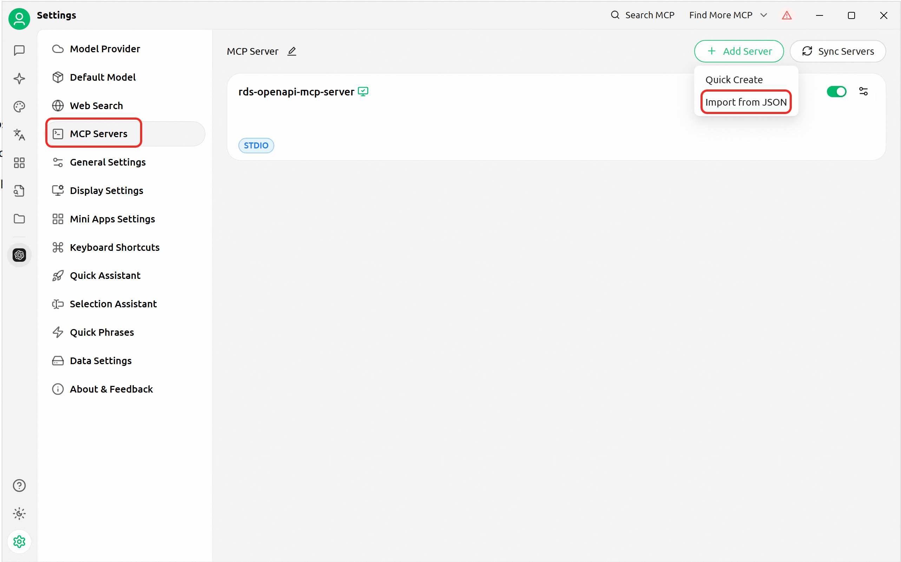
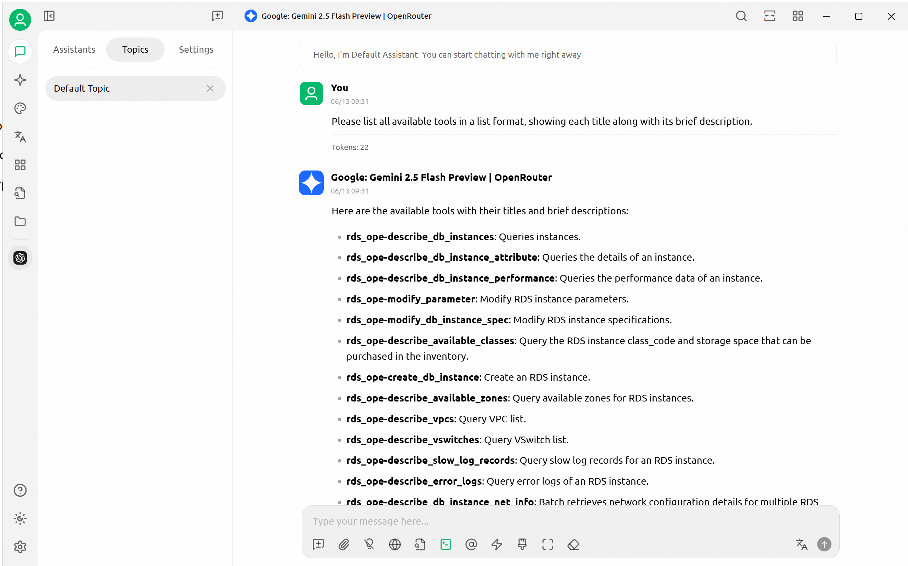

# Alibaba Cloud RDS OpenAPI MCP Server

🚀 Provides MCP server support for Alibaba Cloud RDS through OpenAPI. This project exposes Alibaba Cloud RDS, VPC, and billing APIs through the [MCP](https://github.com/CherryHQ/mcp) framework, packaging common database management tasks into easy-to-use tools.


> ⚠️ **Note**: This documentation is based on Windows platform.

## 📋 Table of Contents
- [✨ Features](#-features)
- [📋 Prerequisites](#-prerequisites)
- [🔧 Installation](#-installation)
- [⚙️ Configuration](#️-configuration)
- [🚀 Quick Start](#-quick-start)
- [🛠️ Available Tools](#️-available-tools)
- [💡 Usage Scenarios](#-usage-scenarios)
- [🔌 Integration](#-integration)
- [🤝 Contributing](#-contributing)
- [📄 License](#-license)
- [💬 Support](#-support)

## ✨ Features

- 🏗️ **Comprehensive RDS Management**: Create, configure, and manage RDS instances
- 🔒 **Security & Compliance**: IP allowlist management and security auditing
- 📊 **Performance Monitoring**: Query performance metrics and logs
- 💰 **Cost Optimization**: Billing analysis and resource optimization
- 🌐 **Multi-Environment Support**: Development, testing, and production environments
- 🔗 **VPC Integration**: Complete VPC and switch management capabilities

## 📋 Prerequisites

- 🐍 Python 3.12 or higher
- ☁️ Alibaba Cloud account with appropriate permissions
- 🔑 Access Key ID and Access Key Secret (or STS Token)

## 🔧 Installation

### Method 1: Quick Start with uv (Recommended)

1. **Install uv**
   ```powershell
   powershell -ExecutionPolicy ByPass -c "irm https://astral.sh/uv/install.ps1 | iex"
   ```

2. **Run the server**
   ```bash
   uvx alibabacloud-rds-openapi-mcp-server@latest
   ```

### Method 2: Install from Source

1. **Install Python 3.12+**
   
   Download from [Python official website](https://www.python.org/downloads/)

2. **Clone the repository**
   ```bash
   git clone https://github.com/aliyun/alibabacloud-rds-openapi-mcp-server.git
   cd alibabacloud-rds-openapi-mcp-server
   ```

3. **Install dependencies**
   ```bash
   pip install -i https://mirrors.aliyun.com/pypi/simple/ alibabacloud_bssopenapi20171214
   pip install -i https://mirrors.aliyun.com/pypi/simple/ alibabacloud_rds20140815
   pip install -i https://mirrors.aliyun.com/pypi/simple/ alibabacloud_vpc20160428
   pip install -i https://mirrors.aliyun.com/pypi/simple/ mcp
   ```

4. **Run the server**
   ```bash
   python src/alibabacloud_rds_openapi_mcp_server/server.py
   ```

## ⚙️ Configuration

### Environment Variable Setup

Before starting the MCP server, you need to set the necessary environment variables:

#### PowerShell Configuration
```powershell
# Set server transport mode
$env:SERVER_TRANSPORT="sse"

# Set Alibaba Cloud credentials
$env:ALIBABA_CLOUD_ACCESS_KEY_ID="<Your AccessKey ID>"
$env:ALIBABA_CLOUD_ACCESS_KEY_SECRET="<Your AccessKey Secret>"

# Optional: Set STS Token when using temporary credentials
$env:ALIBABA_CLOUD_SECURITY_TOKEN="<Your STS Security Token>"
```

#### Command Prompt (CMD) Configuration
```cmd
REM Set server transport mode
set SERVER_TRANSPORT=sse

REM Set Alibaba Cloud credentials
set ALIBABA_CLOUD_ACCESS_KEY_ID=<Your AccessKey ID>
set ALIBABA_CLOUD_ACCESS_KEY_SECRET=<Your AccessKey Secret>

REM Optional: Set STS Token when using temporary credentials
set ALIBABA_CLOUD_SECURITY_TOKEN=<Your STS Security Token>
```

> ⚠️ **Important**: Please replace `<placeholders>` with your actual credential information. These environment variables are only valid for the current terminal session.

## 🚀 Quick Start

### Server Startup Verification

After successful startup, you will see output similar to the following:
```
INFO: Started server process [Process ID]
INFO: Waiting for application startup.
INFO: Application startup complete.
INFO: Uvicorn running on http://0.0.0.0:8000 (Press CTRL+C to quit)
```

### Test Installation

After configuration is complete, you can test the effectiveness of MCP tools using a simple prompt:
```
Please list all available tools in a list format, showing titles and corresponding brief descriptions.
```

## 🛠️ Available Tools

### 🏗️ RDS Instance Management
- `create_db_instance`: Create RDS instance
- `describe_db_instances`: Query instances
- `describe_db_instance_attribute`: Query detailed instance information
- `modify_db_instance_description`: Modify RDS instance description
- `modify_db_instance_spec`: Modify RDS instance specifications
- `restart_db_instance`: Restart RDS instance

### 🔒 Security & Access Control
- `modify_security_ips`: Modify IP allowlist
- `describe_db_instance_ip_allowlist`: Batch query IP allowlist configuration
- `attach_whitelist_template_to_instance`: Bind allowlist template to instance
- `describe_all_whitelist_template`: Query allowlist template list
- `describe_instance_linked_whitelist_template`: Query allowlist templates bound to instances

### 👥 Database & User Management
- `create_db_instance_account`: Create RDS instance account
- `describe_db_instance_accounts`: Batch query account information
- `describe_db_instance_databases`: Batch query database information

### 🌐 Network & Connection
- `allocate_instance_public_connection`: Allocate public connection for RDS instance
- `describe_db_instance_net_info`: Batch query network configuration details
- `describe_vpcs`: Query VPC list
- `describe_vswitches`: Query VSwitch list

### 📊 Monitoring & Performance
- `describe_db_instance_performance`: Query instance performance data
- `describe_error_logs`: Query instance error logs
- `describe_slow_log_records`: Query slow log records of RDS instance
- `describe_db_instance_parameters`: Batch query parameter information
- `modify_parameter`: Modify RDS instance parameters

### 📦 Resource Management
- `describe_available_classes`: Query available instance specifications and storage ranges
- `describe_available_zones`: Query available zones for RDS instances
- `add_tags_to_db_instance`: Add tags to RDS instance

### 💰 Billing & Cost Management
- `describe_bills`: Query user's consumption summary for all product instances or billing items within a specific billing cycle

### 🔧 Utility Tools
- `get_current_time`: Get current time

## 💡 Usage Scenarios

### Scenario 1: Resource Provisioning & Environment Initialization 🏗️

**Create a production RDS MySQL instance in Hangzhou region:**
```
Create a production RDS MySQL instance in cn-hangzhou region with configuration, version, allowlist and other settings identical to instance rm-bp1696hd82oc438fl, and tag it with: production environment audit, release before month-end
```

**Create read-only user account:**
```
On instance rm-bp1696hd82oc438fl in cn-hangzhou region, create a read-only account readonly_user with password: Strong!Pa$$word and grant it read-only access to the report_db database.
```

### Scenario 2: Security & Compliance Automation Audit 🔒

**Add bastion host IP to security group:**
```
Immediately add the new bastion host IP 100.101.102.103 to the 'ops_allowlist' security group of all RDS MySQL instances in cn-hangzhou region.
```

**Security compliance audit:**
```
Audit all RDS SQL Server instances and find all instances in cn-hangzhou whose allowlist does not include IP 123.123.123.123
```

### Scenario 3: Cost Optimization 💰

**Performance-based cost optimization:**
```
Analyze all RDS MySQL instances tagged as "test environment" in cn-hangzhou region over the past 3 days, identify those with average CPU utilization below 5%, and recommend more economical instance specifications.
```

### Scenario 4: Common Operations & Maintenance 🔧

**Instance troubleshooting:**
```
Instance rm-bp1696hd82oc438f in cn-hangzhou region is currently unreachable, please immediately attempt to restart this instance.
```

## 🔌 Integration

### Cherry Studio Integration (Recommended) 🍒

Cherry Studio is a cross-platform AI client that integrates multiple large language models, supporting AI conversations, drawing, and other features designed to enhance creative efficiency.

Add the following configuration to your MCP client configuration file:

```json
{
  "mcpServers": {
    "rds-openapi-mcp-server": {
      "command": "uvx",
      "args": [
        "alibabacloud-rds-openapi-mcp-server@latest"
      ],
      "env": {
        "ALIBABA_CLOUD_ACCESS_KEY_ID": "your_access_id",
        "ALIBABA_CLOUD_ACCESS_KEY_SECRET": "your_access_key",
        "ALIBABA_CLOUD_SECURITY_TOKEN": "your_sts_token"
      }
    }
  }
}
```

<div align="left">
  
</div>
*Configuring RDS MCP Server in Cherry Studio*

<div align="left">
  
</div>
*Displaying all available tools in Cherry Studio*

> 📝 **Note**: `ALIBABA_CLOUD_SECURITY_TOKEN` should only be filled when using STS Token. If using AccessKey method, please leave this value empty.

### Claude Desktop Integration 🤖

Add to your MCP client configuration:

```json
{
  "mcpServers": {
    "rds-openapi-mcp-server": {
      "command": "uv",
      "args": [
        "--directory",
        "d:/path/to/alibabacloud-rds-openapi-mcp-server/src/alibabacloud_rds_openapi_mcp_server",
        "run",
        "server.py"
      ],
      "env": {
        "ALIBABA_CLOUD_ACCESS_KEY_ID": "your_access_id",
        "ALIBABA_CLOUD_ACCESS_KEY_SECRET": "your_access_key",
        "ALIBABA_CLOUD_SECURITY_TOKEN": "your_sts_token"
      }
    }
  }
}
```

## 🤝 Contributing

We welcome your contributions! Please follow these steps:

1. 🍴 Fork this repository
2. 🌟 Create a feature branch (`git checkout -b feature/amazing-feature`)
3. 💾 Commit your changes (`git commit -m 'Add new feature'`)
4. 📤 Push to the branch (`git push origin feature/amazing-feature`)
5. 🔄 Create a Pull Request

## 📄 License

This project is licensed under the Apache 2.0 License

## 💬 Support

For questions, feedback, or support, please contact us through:

- 💬 **DingTalk Group**: 106730017609
- 🐛 **GitHub Issues**: [Create Issue](https://github.com/aliyun/alibabacloud-rds-openapi-mcp-server/issues)

### FAQ ❓

<details>
<summary>How to obtain Alibaba Cloud AccessKey?</summary>

1. Log in to Alibaba Cloud Console
2. Click on the avatar in the upper right corner and select "AccessKey Management"
3. Create a new AccessKey pair
4. Keep your AccessKey Secret secure

</details>

<details>
<summary>Which RDS database engines are supported?</summary>

Currently supported:
- MySQL
- SQL Server  
- PostgreSQL
- MariaDB

</details>